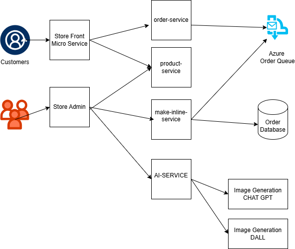

# Best Buy Cloud-Native Application - Lab Project Assignment 2

Welcome to the **Best Buy Cloud-Native Application**, a lab project designed to explore and deploy a realistic cloud-native microservices architecture. This application demonstrates the use of containerized microservices deployed in a Kubernetes cluster, leveraging modern technologies and practices such as event-driven design, polyglot architecture, and open-source back-end services like RabbitMQ and MongoDB.

The application also incorporates OpenAI's models for generating product descriptions and images. These can be powered by either [Azure OpenAI](https://learn.microsoft.com/azure/ai-services/openai/overview) or [OpenAI](https://openai.com/).

> **Note:**  
> This project serves as an educational tool to understand cloud-native application design. It is not intended for production use but to demonstrate a realistic application running in Kubernetes.

## Architecture

The project includes the following services:

| Service            | Description                                                               | GitHub Repo                                                                                   |
|--------------------|---------------------------------------------------------------------------|-----------------------------------------------------------------------------------------------|
| `store-front`      | Web application for customers to browse and place orders (Vue.js).       | [store-front-L8](https://github.com/msalmannaqvi/store-front-L8)                              |
| `store-admin`      | Web application for employees to manage products and orders (Vue.js).    | [store-admin-L8](https://github.com/msalmannaqvi/store-admin-L8)                              |
| `order-service`    | Microservice for managing order placements (JavaScript).                | [order-service-L8](https://github.com/msalmannaqvi/order-service-L8)                          |
| `product-service`  | Microservice for product CRUD operations (Rust).                        | [product-service-L8](https://github.com/msalmannaqvi/product-service-L8)                      |
| `makeline-service` | Microservice for processing and completing orders from the queue (Go).   | [makeline-service-L8](https://github.com/msalmannaqvi/makeline-service-L8)                    |
| `ai-service`       | Optional service for generating text and images using OpenAI (Python).  | [ai-service-L8](https://github.com/msalmannaqvi/ai-service-L8)                                |
| `rabbitmq`         | RabbitMQ message broker for handling the order queue.                   | [rabbitmq](https://github.com/msalmannaqvi/rabbitmq)                                          |
| `mongodb`          | MongoDB instance for persistent storage.                                | [mongodb](https://github.com/msalmannaqvi/mongodb)                                            |
| `virtual-customer` | Service for simulating customer order placement (Rust).                 | [virtual-customer-L8](https://github.com/msalmannaqvi/virtual-customer-L8)                    |
| `virtual-worker`   | Service for simulating order processing and completion (Rust).          | [virtual-worker-L8](https://github.com/msalmannaqvi/virtual-worker-L8)                        |

### Application Diagram

Below is the logical architecture of  application:



## Deployment on Azure Kubernetes Service (AKS)

To deploy this application to an AKS cluster, use the Kubernetes YAML files provided in the [Deployment Files](./Deployment%20Files/) directory. Follow these steps:

1. Set up an AKS cluster in Azure.
2. Use `kubectl` to apply the YAML files to your cluster:
   ```bash
   kubectl apply -f ./Deployment Files/
